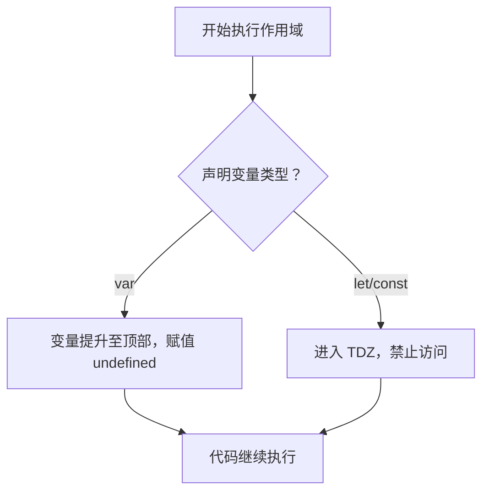

## 一、开篇小故事：租房风波，谁能先入住？

> 🏠 阿杰、小美和小亮三人抢租一套房。
>
> * 房东说：“只能提前订的人才能住！”
> * 阿杰提前电话订了（`var`）。
> * 小美当面签合同但还没交钱（`let`）。
> * 小亮压根没签（没声明变量）。

这时大家抢进门：

* 阿杰被提前认定，不管有没有真正入住，都算“占坑”了 ——**变量提升**。
* 小美必须交钱后才能进屋，且在她交钱前任何访问都**会被拒绝** ——**暂时性死区（TDZ）**。
* 小亮？直接被拦下：“你谁啊？”

这套比喻就是在解释 `var` / `let` / `const` 在 JS 中的作用！

---

## 二、JavaScript 中的变量声明方式对比

### 1. var（老兵）：能用但有坑

```js
console.log(a); // undefined（被提升了）
var a = 10;
```

✅ 优点：

* 支持变量提升（但这往往是个坑）

⚠️ 缺点：

* 没有块级作用域
* 可重复声明
* 容易污染全局变量

---

### 2. let（现代方式）：推荐使用

```js
console.log(b); // ❌ 报错：Cannot access 'b' before initialization
let b = 20;
```

✅ 特点：

* 有块级作用域
* 不允许重复声明
* 存在“暂时性死区”（TDZ）保护变量未初始化前被访问

---

### 3. const（不可变变量）

```js
const PI = 3.14;
PI = 3.14159; // ❌ 报错：Assignment to constant variable
```

✅ 特点：

* 声明后不能再赋值
* 也存在 TDZ
* 用于声明常量（如配置、固定值等）

---

## 三、一图看懂：var、let、const 对比


> 图片来源于网络

---

## 四、作用域到底是啥？

### 🎯 变量作用域 = 变量能用的“范围”

```js
function testScope() {
  let x = 10;
  console.log(x); // ✅ OK
}
console.log(x); // ❌ 报错：x is not defined
```

| 类型    | 范围举例                   |
| ----- | ---------------------- |
| 全局作用域 | 页面/文件最外层的变量            |
| 函数作用域 | 函数体内部声明的变量             |
| 块级作用域 | 用 `{}` 包裹的任意语句块，如 if 等 |

---

## 五、变量提升与 TDZ 图解

```js
function example() {
  console.log(a); // undefined （被提升）
  console.log(b); // ❌ 报错（TDZ）
  var a = 1;
  let b = 2;
}
```

### 🔍 TDZ（暂时性死区）是什么？

当你使用 `let` 或 `const` 声明变量时，从作用域开始到声明语句之间的区域称为“**死区**”，变量不可访问。

### 📈 图解如下：

```
function block() {
  |-------------------|
  TDZ 开始       TDZ 结束
          let x = 5;
}
```

---

## 六、常见问题实战与解法

### ✅ 使用场景1：循环中的闭包问题

```js
// 使用 var，结果是 5 个 5
for (var i = 0; i < 5; i++) {
  setTimeout(() => console.log(i), 100);
}

// 使用 let，结果是 0 1 2 3 4
for (let i = 0; i < 5; i++) {
  setTimeout(() => console.log(i), 100);
}
```

**👉 原因：let 在每次循环中都创建了新的块级作用域**

---

### ✅ 使用场景2：防止重复声明错误

```js
let a = 1;
let a = 2; // ❌ 报错：Identifier 'a' has already been declared
```

---

## 七、流程图总结：声明变量流程



---

## 八、兼容建议与实用技巧

### ✅ 推荐实践：

* 默认使用 `const`（先声明常量）
* 变量需改动才用 `let`
* 避免使用 `var`

---

## 九、配套工具建议

* 使用 [ESLint](https://eslint.bootcss.com/) 统一规范代码 ✅
* 使用 Babel 自动兼容旧浏览器 ✅
* 使用 Vite/Webpack 等打包工具时可配置默认使用 `let/const`

---

## 🔚 小结

| 特性    | var             | let       | const     |
| ----- | --------------- | --------- | --------- |
| 作用域   | 函数              | 块         | 块         |
| 提升    | 是（值为 undefined） | 否（TDZ 报错） | 否（TDZ 报错） |
| 可重复声明 | 是               | 否         | 否         |
| 可重新赋值 | 是               | 是         | 否         |

---

## 📚 参考资料 & 推荐阅读

| 类型       | 链接                                                                                                     |
| -------- | ------------------------------------------------------------------------------------------------------ |
| 官方文档     | [MDN let/const 详解](https://developer.mozilla.org/zh-CN/docs/Web/JavaScript/Reference/Statements/let) ✅ |
| 中文教程     | [现代 JavaScript 教程 - 变量章节](https://zh.javascript.info/variables) ✅                                      |
| CSDN 学习文 | [let、var、const 的区别和使用场景](https://blog.csdn.net/weixin_43931625/article/details/108091248) ✅            |

---